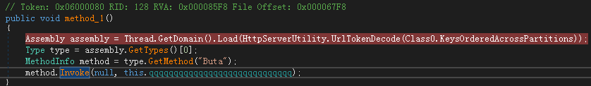
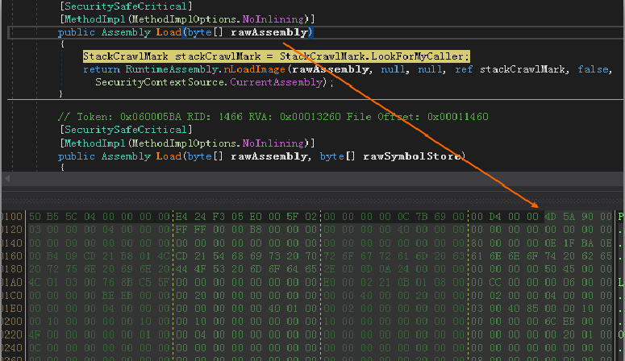
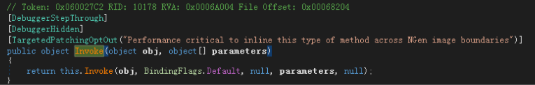
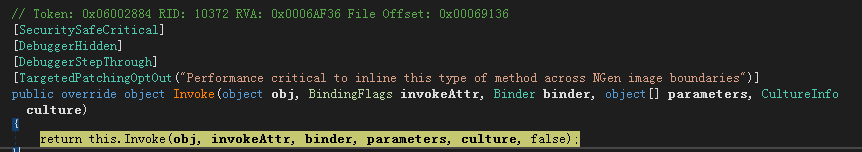
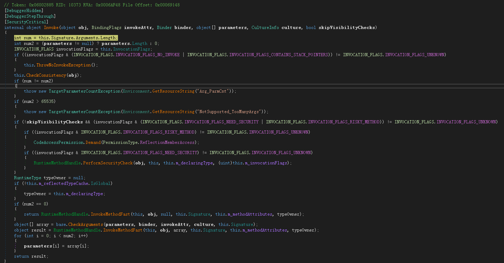
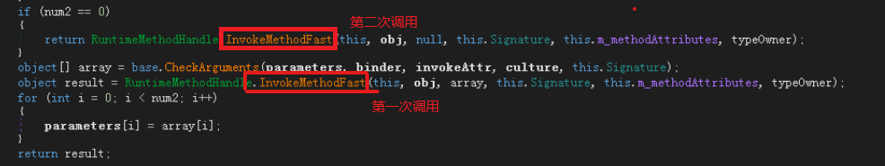
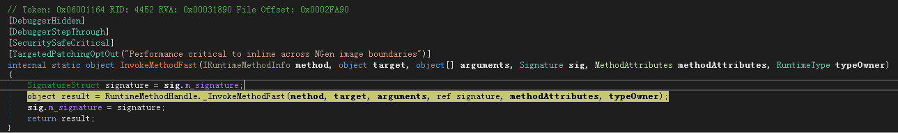
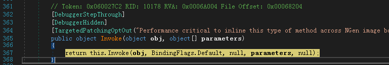
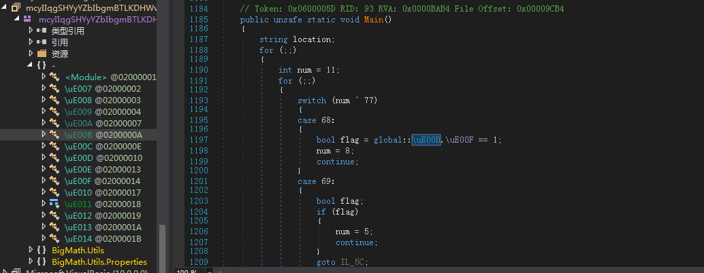

#net注入Pe调试
```C
Assembly assembly = Load(bytes_PE);                 //加载内存PE
Type type = assembly.GetTypes()[i];                 //获取类型 i 代表第几个类
MethodInfo method = type.GetMethod(name_method);    //获取类下的方法name_method
method.Invoke(param1, param2, ...);                 //调用参数
```


其中内存PE如下：



# 内存注入调试
> 使用dnspy动态调试， 注意此种动态调试与系统有关，若无法进入，则更新window .net框架

- F11进入Invoke函数  


- 继续F11进入函数   


- 继续F11进入函数到达最终`invoke`执行的函数


- 最终会调用 `InvokemethodFast` 函数，会首先进入下面的`InvokemethodFast`,然后在进入上面的`InvokemethodFast`


- F11进入 `InvokemethodFast` 函数


- F11继续进入`_InvokemethodFast` 函数  


- F11 最终进入调用的函数或者main函数  
