# CrossC2的paload分析

## 简述
&nbsp;&nbsp;&nbsp;&nbsp;&nbsp;&nbsp;&nbsp;&nbsp;Cross C2是一个支持Linux & MacOS系统的拓展插件，支持用户自定义生成的动态库，以无文件落地的方式从内存中加载执行动态库或可执行文件。用法我的想法来说，相当于一个小集群，插件化方便利用，实际的渗透中意义并不大，更加实际于命令行渗透，做到无文件落地，过流量检测加密免杀等技术的研究

&nbsp;&nbsp;&nbsp;&nbsp;&nbsp;&nbsp;&nbsp;&nbsp;简而言之：一个CS的简单小插件，目的就是上线Linux主机， 可做一些简单的操作，记录一下使用过程中遇到的一些问题，并且在使用中操作的正确性

[Github](https://github.com/gloxec/CrossC2)

## payload
### 生成可执行文件的命令
- 使用GUI方式:
    参考此[链接](https://www.zyxiao.com/p/32620),使用此插件。笔者未成功，所以选择直接生成

- 直接生成:
    ```
    [usage]: ./genCrossC2.Linux [host] [port] [getURI] [postURI] [platform] [arch] [outputFileName]
            -platform:'MacOS'/'Linux'
            -arch：'x86'/'x64'
    [ex]:    ./genCrossC2.Linux 127.0.0.1 1111 null null Linux x64 C2
    ```

### payload特征
#### 静态分析
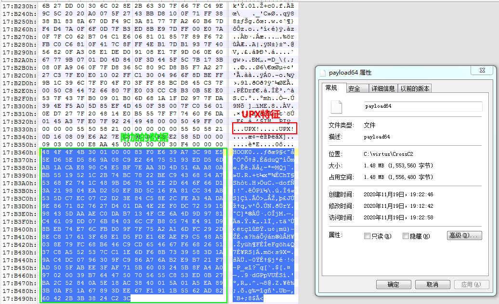

&nbsp;&nbsp;&nbsp;&nbsp;&nbsp;&nbsp;&nbsp;&nbsp;经过多次生成样本，对比发现，并根据其中的`UPX`特征分析，前面为`不变`的压缩UPX文件，图中框选的部分为数据部分。

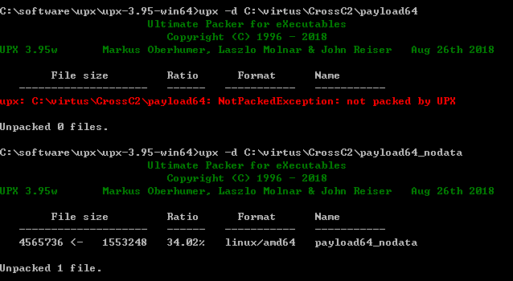

&nbsp;&nbsp;&nbsp;&nbsp;&nbsp;&nbsp;&nbsp;&nbsp;使用UPX工具直接解密生成的payload,无法解密。原因在于后面添加了部分数据，不符合解压方式，所以剪切了数据区，然后可以解密

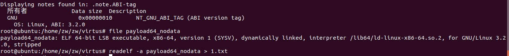

对此文件进行基本信息获取 使用
- file payload64_nodata
- readelf payload64_nodata
查看基本信息

其中重定位节信息十分重要，这对快速分析生成的payload有重大作用
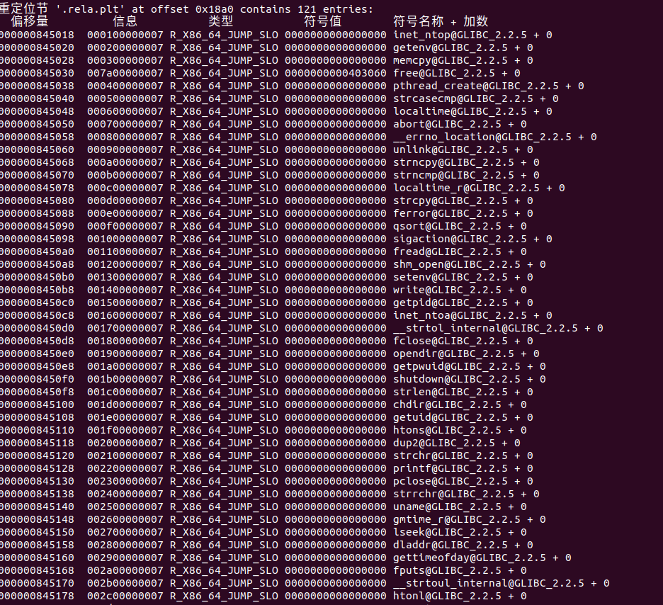


#### 动态分析
&nbsp;&nbsp;&nbsp;&nbsp;&nbsp;&nbsp;&nbsp;&nbsp;由于原始生成的payload中使用的是upx压缩，而且删除数据区域解压后的为无法在相同条件下动态调试。（实际上，后来分析此样本是使用文件偏移获取数据区域，进行解密的。）故首先先通过[upx脱壳](https://www.52pojie.cn/forum.php?mod=viewthread&tid=1048649&highlight=UPX)了解如何动态调试到入口，这里简要截图示意：

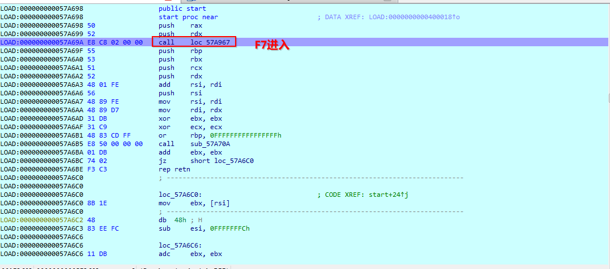
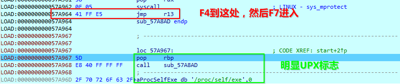
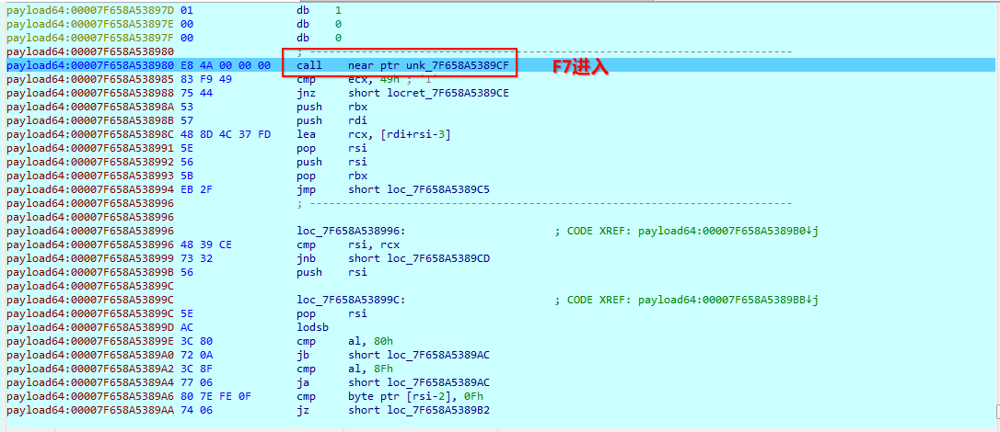
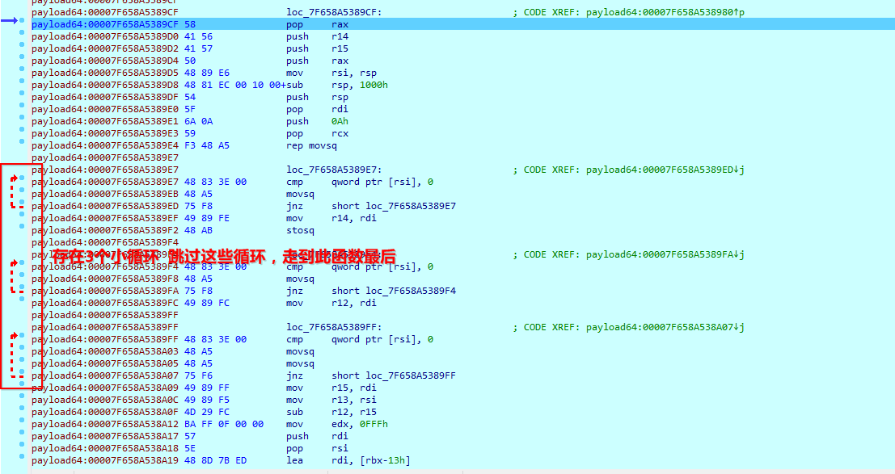
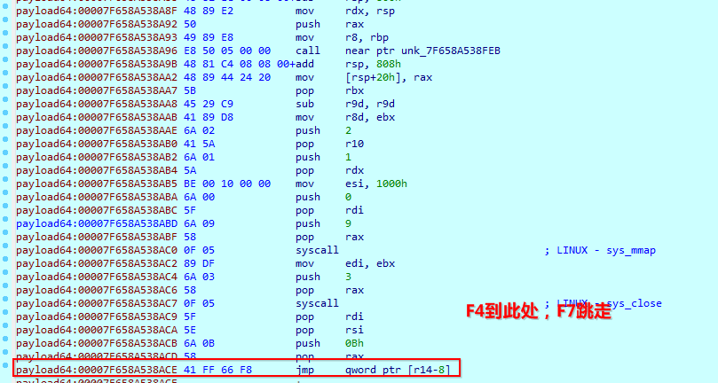
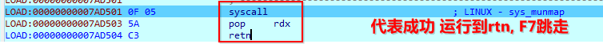
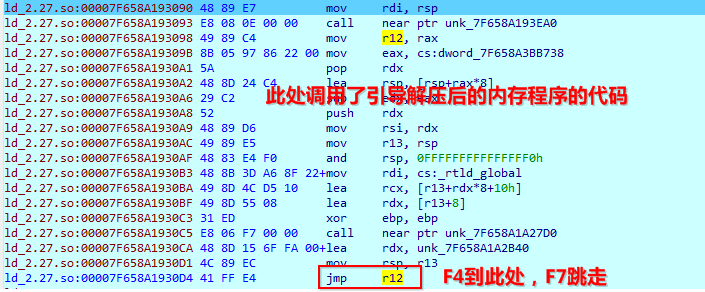
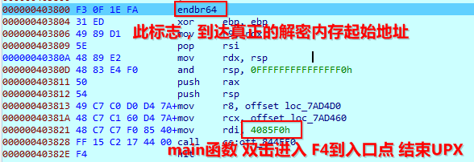
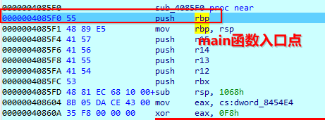

&nbsp;&nbsp;&nbsp;&nbsp;&nbsp;&nbsp;&nbsp;&nbsp;经过分析与初步调试，在内存中解密的代码存在大量的`代码膨胀`,如下图：
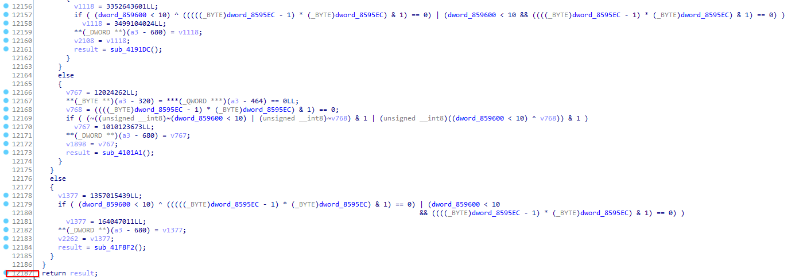
&nbsp;&nbsp;&nbsp;&nbsp;&nbsp;&nbsp;&nbsp;&nbsp;所以需要使用别的方法，如下图，左边是未upx解密的内存中的got段，右边是解密的got段可以看到，使用相同的函数形式，以此调试时可以做对比，查询相应调用的函数
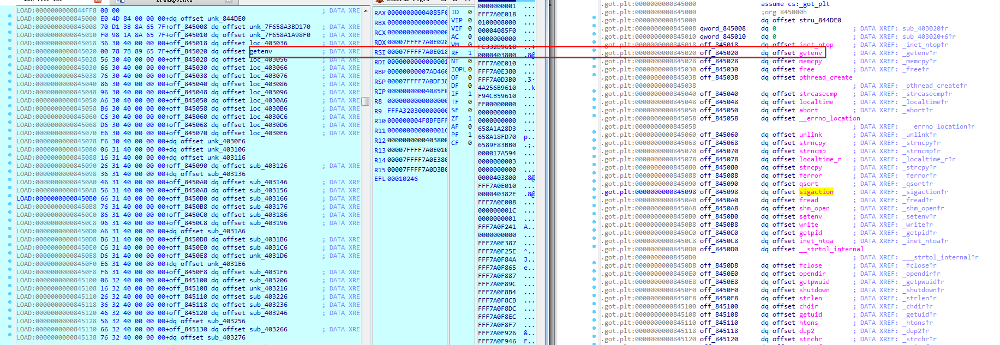

&nbsp;&nbsp;&nbsp;&nbsp;&nbsp;&nbsp;&nbsp;&nbsp;这里，看一下下面这个函数
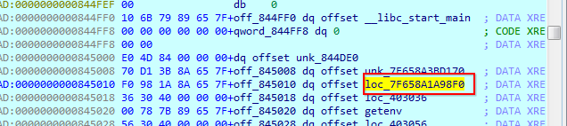
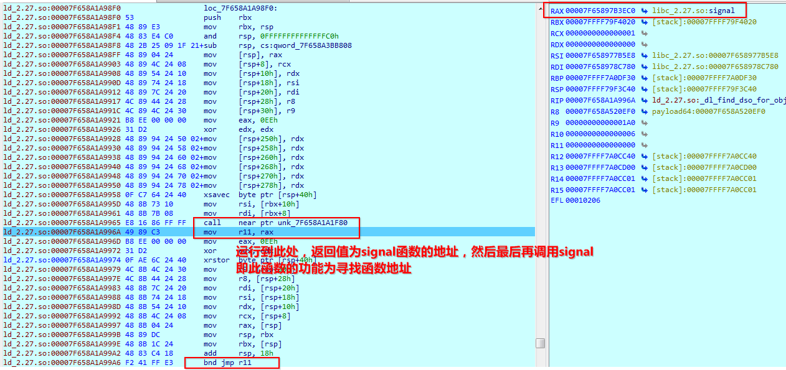

所以只要接下来对上图中这个函数中的运行获取函数地址后进行下断点，然后使用对比表进行

<table>
   <tr>
      <td>地址 </td>
      <td>偏移</td>
      <td>函数</td>
   </tr>
   <tr>
      <td>0x0000000000845018 </td>
      <td>36 30 40 00 00 00 00 00 </td>
      <td>off_845018 dq offset sub_403036         ; DATA XREF: _inet_ntop↑r</td>
   </tr>
   <tr>
      <td>0x0000000000845020 </td>
      <td>00 C8 99 DC C6 7F 00 00 </td>
      <td>off_845020 dq offset getenv             ; DATA XREF: _getenv↑r</td>
   </tr>
   <tr>
      <td>0x0000000000845028 </td>
      <td>56 30 40 00 00 00 00 00 </td>
      <td>off_845028 dq offset sub_403056         ; DATA XREF: _memcpy↑r</td>
   </tr>
   <tr>
      <td>0x0000000000845030 </td>
      <td>66 30 40 00 00 00 00 00 </td>
      <td>off_845030 dq offset sub_403066         ; DATA XREF: _free↑r</td>
   </tr>
   <tr>
      <td>0x0000000000845038 </td>
      <td>76 30 40 00 00 00 00 00 </td>
      <td>off_845038 dq offset sub_403076         ; DATA XREF: _pthread_create↑r</td>
   </tr>
   <tr>
      <td>0x0000000000845040 </td>
      <td>86 30 40 00 00 00 00 00 </td>
      <td>off_845040 dq offset sub_403086         ; DATA XREF: _strcasecmp↑r</td>
   </tr>
   <tr>
      <td>0x0000000000845048 </td>
      <td>96 30 40 00 00 00 00 00 </td>
      <td>off_845048 dq offset sub_403096         ; DATA XREF: _localtime↑r</td>
   </tr>
   <tr>
      <td>0x0000000000845050 </td>
      <td>A6 30 40 00 00 00 00 00 </td>
      <td>off_845050 dq offset sub_4030A6         ; DATA XREF: _abort↑r</td>
   </tr>
   <tr>
      <td>0x0000000000845058 </td>
      <td>B6 30 40 00 00 00 00 00 </td>
      <td>off_845058 dq offset sub_4030B6         ; DATA XREF: ___errno_location↑r</td>
   </tr>
   <tr>
      <td>0x0000000000845060 </td>
      <td>C6 30 40 00 00 00 00 00 </td>
      <td>off_845060 dq offset sub_4030C6         ; DATA XREF: _unlink↑r</td>
   </tr>
   <tr>
      <td>0x0000000000845068 </td>
      <td>D6 30 40 00 00 00 00 00 </td>
      <td>off_845068 dq offset sub_4030D6         ; DATA XREF: _strncpy↑r</td>
   </tr>
   <tr>
      <td>0x0000000000845070 </td>
      <td>E6 30 40 00 00 00 00 00 </td>
      <td>off_845070 dq offset sub_4030E6         ; DATA XREF: _strncmp↑r</td>
   </tr>
   <tr>
      <td>0x0000000000845078 </td>
      <td>F6 30 40 00 00 00 00 00 </td>
      <td>off_845078 dq offset sub_4030F6         ; DATA XREF: _localtime_r↑r</td>
   </tr>
   <tr>
      <td>0x0000000000845080 </td>
      <td>06 31 40 00 00 00 00 00 </td>
      <td>off_845080 dq offset sub_403106         ; DATA XREF: _strcpy↑r</td>
   </tr>
   <tr>
      <td>0x0000000000845088 </td>
      <td>16 31 40 00 00 00 00 00 </td>
      <td>off_845088 dq offset sub_403116         ; DATA XREF: _ferror↑r</td>
   </tr>
   <tr>
      <td>0x0000000000845090 </td>
      <td>26 31 40 00 00 00 00 00 </td>
      <td>off_845090 dq offset sub_403126         ; DATA XREF: _qsort↑r</td>
   </tr>
   <tr>
      <td>0x0000000000845098 </td>
      <td>36 31 40 00 00 00 00 00 </td>
      <td>off_845098 dq offset sub_403136         ; DATA XREF: _sigaction↑r</td>
   </tr>
   <tr>
      <td>0x00000000008450A0 </td>
      <td>46 31 40 00 00 00 00 00 </td>
      <td>off_8450A0 dq offset sub_403146         ; DATA XREF: _fread↑r</td>
   </tr>
   <tr>
      <td>0x00000000008450A8 </td>
      <td>56 31 40 00 00 00 00 00 </td>
      <td>off_8450A8 dq offset sub_403156         ; DATA XREF: _shm_open↑r</td>
   </tr>
   <tr>
      <td>0x00000000008450B0 </td>
      <td>66 31 40 00 00 00 00 00 </td>
      <td>off_8450B0 dq offset sub_403166         ; DATA XREF: _setenv↑r</td>
   </tr>
   <tr>
      <td>0x00000000008450B8 </td>
      <td>76 31 40 00 00 00 00 00 </td>
      <td>off_8450B8 dq offset sub_403176         ; DATA XREF: _write↑r</td>
   </tr>
   <tr>
      <td>0x00000000008450C0 </td>
      <td>86 31 40 00 00 00 00 00 </td>
      <td>off_8450C0 dq offset sub_403186         ; DATA XREF: _getpid↑r</td>
   </tr>
   <tr>
      <td>0x00000000008450C8 </td>
      <td>96 31 40 00 00 00 00 00 </td>
      <td>off_8450C8 dq offset sub_403196         ; DATA XREF: _inet_ntoa↑r</td>
   </tr>
   <tr>
      <td>0x00000000008450D0 </td>
      <td>A6 31 40 00 00 00 00 00 </td>
      <td>off_8450D0 dq offset sub_4031A6         ; DATA XREF: ___strtol_internal↑r</td>
   </tr>
   <tr>
      <td>0x00000000008450D8 </td>
      <td>B6 31 40 00 00 00 00 00 </td>
      <td>off_8450D8 dq offset sub_4031B6         ; DATA XREF: _fclose↑r</td>
   </tr>
   <tr>
      <td>0x00000000008450E0 </td>
      <td>C6 31 40 00 00 00 00 00 </td>
      <td>off_8450E0 dq offset sub_4031C6         ; DATA XREF: _opendir↑r</td>
   </tr>
   <tr>
      <td>0x00000000008450E8 </td>
      <td>D6 31 40 00 00 00 00 00 </td>
      <td>off_8450E8 dq offset sub_4031D6         ; DATA XREF: _getpwuid↑r</td>
   </tr>
   <tr>
      <td>0x00000000008450F0 </td>
      <td>E6 31 40 00 00 00 00 00 </td>
      <td>off_8450F0 dq offset sub_4031E6         ; DATA XREF: _shutdown↑r</td>
   </tr>
   <tr>
      <td>0x00000000008450F8 </td>
      <td>F6 31 40 00 00 00 00 00 </td>
      <td>off_8450F8 dq offset sub_4031F6         ; DATA XREF: _strlen↑r</td>
   </tr>
   <tr>
      <td>0x0000000000845100 </td>
      <td>06 32 40 00 00 00 00 00 </td>
      <td>off_845100 dq offset sub_403206         ; DATA XREF: _chdir↑r</td>
   </tr>
   <tr>
      <td>0x0000000000845108 </td>
      <td>16 32 40 00 00 00 00 00 </td>
      <td>off_845108 dq offset sub_403216         ; DATA XREF: _getuid↑r</td>
   </tr>
   <tr>
      <td>0x0000000000845110 </td>
      <td>26 32 40 00 00 00 00 00 </td>
      <td>off_845110 dq offset sub_403226         ; DATA XREF: _htons↑r</td>
   </tr>
   <tr>
      <td>0x0000000000845118 </td>
      <td>36 32 40 00 00 00 00 00 </td>
      <td>off_845118 dq offset sub_403236         ; DATA XREF: _dup2↑r</td>
   </tr>
   <tr>
      <td>0x0000000000845120 </td>
      <td>46 32 40 00 00 00 00 00 </td>
      <td>off_845120 dq offset sub_403246         ; DATA XREF: _strchr↑r</td>
   </tr>
   <tr>
      <td>0x0000000000845128 </td>
      <td>56 32 40 00 00 00 00 00 </td>
      <td>off_845128 dq offset sub_403256         ; DATA XREF: _printf↑r</td>
   </tr>
   <tr>
      <td>0x0000000000845130 </td>
      <td>66 32 40 00 00 00 00 00 </td>
      <td>off_845130 dq offset sub_403266         ; DATA XREF: _pclose↑r</td>
   </tr>
   <tr>
      <td>0x0000000000845138 </td>
      <td>76 32 40 00 00 00 00 00 </td>
      <td>off_845138 dq offset sub_403276         ; DATA XREF: _strrchr↑r</td>
   </tr>
   <tr>
      <td>0x0000000000845140 </td>
      <td>86 32 40 00 00 00 00 00 </td>
      <td>off_845140 dq offset sub_403286         ; DATA XREF: _uname↑r</td>
   </tr>
   <tr>
      <td>0x0000000000845148 </td>
      <td>96 32 40 00 00 00 00 00 </td>
      <td>off_845148 dq offset sub_403296         ; DATA XREF: _gmtime_r↑r</td>
   </tr>
   <tr>
      <td>0x0000000000845150 </td>
      <td>A6 32 40 00 00 00 00 00 </td>
      <td>off_845150 dq offset sub_4032A6         ; DATA XREF: _lseek↑r</td>
   </tr>
   <tr>
      <td>0x0000000000845158 </td>
      <td>B6 32 40 00 00 00 00 00 </td>
      <td>off_845158 dq offset sub_4032B6         ; DATA XREF: _dladdr↑r</td>
   </tr>
   <tr>
      <td>0x0000000000845160 </td>
      <td>C6 32 40 00 00 00 00 00 </td>
      <td>off_845160 dq offset sub_4032C6         ; DATA XREF: _gettimeofday↑r</td>
   </tr>
   <tr>
      <td>0x0000000000845168 </td>
      <td>D6 32 40 00 00 00 00 00 </td>
      <td>off_845168 dq offset sub_4032D6         ; DATA XREF: _fputs↑r</td>
   </tr>
   <tr>
      <td>0x0000000000845170 </td>
      <td>E6 32 40 00 00 00 00 00 </td>
      <td>off_845170 dq offset sub_4032E6         ; DATA XREF: ___strtoul_internal↑r</td>
   </tr>
   <tr>
      <td>0x0000000000845178 </td>
      <td>F6 32 40 00 00 00 00 00 </td>
      <td>off_845178 dq offset sub_4032F6         ; DATA XREF: _htonl↑r</td>
   </tr>
   <tr>
      <td>0x0000000000845180 </td>
      <td>06 33 40 00 00 00 00 00 </td>
      <td>off_845180 dq offset sub_403306         ; DATA XREF: _memset↑r</td>
   </tr>
   <tr>
      <td>0x0000000000845188 </td>
      <td>16 33 40 00 00 00 00 00 </td>
      <td>off_845188 dq offset sub_403316         ; DATA XREF: _geteuid↑r</td>
   </tr>
   <tr>
      <td>0x0000000000845190 </td>
      <td>26 33 40 00 00 00 00 00 </td>
      <td>off_845190 dq offset sub_403326         ; DATA XREF: _getcwd↑r</td>
   </tr>
   <tr>
      <td>0x0000000000845198 </td>
      <td>36 33 40 00 00 00 00 00 </td>
      <td>off_845198 dq offset sub_403336         ; DATA XREF: _close↑r</td>
   </tr>
   <tr>
      <td>0x00000000008451A0 </td>
      <td>46 33 40 00 00 00 00 00 </td>
      <td>off_8451A0 dq offset sub_403346         ; DATA XREF: _pipe↑r</td>
   </tr>
   <tr>
      <td>0x00000000008451A8 </td>
      <td>56 33 40 00 00 00 00 00 </td>
      <td>off_8451A8 dq offset sub_403356         ; DATA XREF: _closedir↑r</td>
   </tr>
   <tr>
      <td>0x00000000008451B0 </td>
      <td>66 33 40 00 00 00 00 00 </td>
      <td>off_8451B0 dq offset sub_403366         ; DATA XREF: _fputc↑r</td>
   </tr>
   <tr>
      <td>0x00000000008451B8 </td>
      <td>76 33 40 00 00 00 00 00 </td>
      <td>off_8451B8 dq offset sub_403376         ; DATA XREF: _memchr↑r</td>
   </tr>
   <tr>
      <td>0x00000000008451C0 </td>
      <td>86 33 40 00 00 00 00 00 </td>
      <td>off_8451C0 dq offset sub_403386         ; DATA XREF: _read↑r</td>
   </tr>
   <tr>
      <td>0x00000000008451C8 </td>
      <td>96 33 40 00 00 00 00 00 </td>
      <td>off_8451C8 dq offset sub_403396         ; DATA XREF: _srand↑r</td>
   </tr>
   <tr>
      <td>0x00000000008451D0 </td>
      <td>A6 33 40 00 00 00 00 00 </td>
      <td>off_8451D0 dq offset sub_4033A6         ; DATA XREF: _memcmp↑r</td>
   </tr>
   <tr>
      <td>0x00000000008451D8 </td>
      <td>B6 33 40 00 00 00 00 00 </td>
      <td>off_8451D8 dq offset sub_4033B6         ; DATA XREF: _fgets↑r</td>
   </tr>
   <tr>
      <td>0x00000000008451E0 </td>
      <td>C6 33 40 00 00 00 00 00 </td>
      <td>off_8451E0 dq offset sub_4033C6         ; DATA XREF: _execve↑r</td>
   </tr>
   <tr>
      <td>0x00000000008451E8 </td>
      <td>D6 33 40 00 00 00 00 00 </td>
      <td>off_8451E8 dq offset sub_4033D6         ; DATA XREF: _calloc↑r</td>
   </tr>
   <tr>
      <td>0x00000000008451F0 </td>
      <td>E6 33 40 00 00 00 00 00 </td>
      <td>off_8451F0 dq offset sub_4033E6         ; DATA XREF: _strcmp↑r</td>
   </tr>
   <tr>
      <td>0x00000000008451F8 </td>
      <td>F6 33 40 00 00 00 00 00 </td>
      <td>off_8451F8 dq offset sub_4033F6         ; DATA XREF: _signal↑r</td>
   </tr>
   <tr>
      <td>0x0000000000845200 </td>
      <td>06 34 40 00 00 00 00 00 </td>
      <td>off_845200 dq offset sub_403406         ; DATA XREF: _fprintf↑r</td>
   </tr>
   <tr>
      <td>0x0000000000845208 </td>
      <td>16 34 40 00 00 00 00 00 </td>
      <td>off_845208 dq offset sub_403416         ; DATA XREF: _syscall↑r</td>
   </tr>
   <tr>
      <td>0x0000000000845210 </td>
      <td>26 34 40 00 00 00 00 00 </td>
      <td>off_845210 dq offset sub_403426         ; DATA XREF: _ftell↑r</td>
   </tr>
   <tr>
      <td>0x0000000000845218 </td>
      <td>36 34 40 00 00 00 00 00 </td>
      <td>off_845218 dq offset sub_403436         ; DATA XREF: _feof↑r</td>
   </tr>
   <tr>
      <td>0x0000000000845220 </td>
      <td>46 34 40 00 00 00 00 00 </td>
      <td>off_845220 dq offset sub_403446         ; DATA XREF: _mkfifo↑r</td>
   </tr>
   <tr>
      <td>0x0000000000845228 </td>
      <td>56 34 40 00 00 00 00 00 </td>
      <td>off_845228 dq offset sub_403456         ; DATA XREF: _fopen64↑r</td>
   </tr>
   <tr>
      <td>0x0000000000845230 </td>
      <td>66 34 40 00 00 00 00 00 </td>
      <td>off_845230 dq offset sub_403466         ; DATA XREF: _inet_pton↑r</td>
   </tr>
   <tr>
      <td>0x0000000000845238 </td>
      <td>76 34 40 00 00 00 00 00 </td>
      <td>off_845238 dq offset sub_403476         ; DATA XREF: _time↑r</td>
   </tr>
   <tr>
      <td>0x0000000000845240 </td>
      <td>86 34 40 00 00 00 00 00 </td>
      <td>off_845240 dq offset sub_403486         ; DATA XREF: _fileno↑r</td>
   </tr>
   <tr>
      <td>0x0000000000845248 </td>
      <td>96 34 40 00 00 00 00 00 </td>
      <td>off_845248 dq offset sub_403496         ; DATA XREF: _getgid↑r</td>
   </tr>
   <tr>
      <td>0x0000000000845250 </td>
      <td>A6 34 40 00 00 00 00 00 </td>
      <td>off_845250 dq offset sub_4034A6         ; DATA XREF: _select↑r</td>
   </tr>
   <tr>
      <td>0x0000000000845258 </td>
      <td>B6 34 40 00 00 00 00 00 </td>
      <td>off_845258 dq offset sub_4034B6         ; DATA XREF: ___xstat↑r</td>
   </tr>
   <tr>
      <td>0x0000000000845260 </td>
      <td>C6 34 40 00 00 00 00 00 </td>
      <td>off_845260 dq offset sub_4034C6         ; DATA XREF: _readdir↑r</td>
   </tr>
   <tr>
      <td>0x0000000000845268 </td>
      <td>D6 34 40 00 00 00 00 00 </td>
      <td>off_845268 dq offset sub_4034D6         ; DATA XREF: _dlopen↑r</td>
   </tr>
   <tr>
      <td>0x0000000000845270 </td>
      <td>E6 34 40 00 00 00 00 00 </td>
      <td>off_845270 dq offset sub_4034E6         ; DATA XREF: _malloc↑r</td>
   </tr>
   <tr>
      <td>0x0000000000845278 </td>
      <td>F6 34 40 00 00 00 00 00 </td>
      <td>off_845278 dq offset sub_4034F6         ; DATA XREF: _strncasecmp↑r</td>
   </tr>
   <tr>
      <td>0x0000000000845280 </td>
      <td>06 35 40 00 00 00 00 00 </td>
      <td>off_845280 dq offset sub_403506         ; DATA XREF: _fflush↑r</td>
   </tr>
   <tr>
      <td>0x0000000000845288 </td>
      <td>16 35 40 00 00 00 00 00 </td>
      <td>off_845288 dq offset sub_403516         ; DATA XREF: _getifaddrs↑r</td>
   </tr>
   <tr>
      <td>0x0000000000845290 </td>
      <td>26 35 40 00 00 00 00 00 </td>
      <td>off_845290 dq offset sub_403526         ; DATA XREF: ___fxstat↑r</td>
   </tr>
   <tr>
      <td>0x0000000000845298 </td>
      <td>36 35 40 00 00 00 00 00 </td>
      <td>off_845298 dq offset sub_403536         ; DATA XREF: _sscanf↑r</td>
   </tr>
   <tr>
      <td>0x00000000008452A0 </td>
      <td>46 35 40 00 00 00 00 00 </td>
      <td>off_8452A0 dq offset sub_403546         ; DATA XREF: _getegid↑r</td>
   </tr>
   <tr>
      <td>0x00000000008452A8 </td>
      <td>56 35 40 00 00 00 00 00 </td>
      <td>off_8452A8 dq offset sub_403556         ; DATA XREF: _daemon↑r</td>
   </tr>
   <tr>
      <td>0x00000000008452B0 </td>
      <td>66 35 40 00 00 00 00 00 </td>
      <td>off_8452B0 dq offset sub_403566         ; DATA XREF: _fseek↑r</td>
   </tr>
   <tr>
      <td>0x00000000008452B8 </td>
      <td>76 35 40 00 00 00 00 00 </td>
      <td>off_8452B8 dq offset sub_403576         ; DATA XREF: _dlclose↑r</td>
   </tr>
   <tr>
      <td>0x00000000008452C0 </td>
      <td>86 35 40 00 00 00 00 00 </td>
      <td>off_8452C0 dq offset sub_403586         ; DATA XREF: _realloc↑r</td>
   </tr>
   <tr>
      <td>0x00000000008452C8 </td>
      <td>96 35 40 00 00 00 00 00 </td>
      <td>off_8452C8 dq offset sub_403596         ; DATA XREF: _freeifaddrs↑r</td>
   </tr>
   <tr>
      <td>0x00000000008452D0 </td>
      <td>A6 35 40 00 00 00 00 00 </td>
      <td>off_8452D0 dq offset sub_4035A6         ; DATA XREF: _setvbuf↑r</td>
   </tr>
   <tr>
      <td>0x00000000008452D8 </td>
      <td>B6 35 40 00 00 00 00 00 </td>
      <td>off_8452D8 dq offset sub_4035B6         ; DATA XREF: _poll↑r</td>
   </tr>
   <tr>
      <td>0x00000000008452E0 </td>
      <td>C6 35 40 00 00 00 00 00 </td>
      <td>off_8452E0 dq offset sub_4035C6         ; DATA XREF: _chmod↑r</td>
   </tr>
   <tr>
      <td>0x00000000008452E8 </td>
      <td>D6 35 40 00 00 00 00 00 </td>
      <td>off_8452E8 dq offset sub_4035D6         ; DATA XREF: _strftime↑r</td>
   </tr>
   <tr>
      <td>0x00000000008452F0 </td>
      <td>E6 35 40 00 00 00 00 00 </td>
      <td>off_8452F0 dq offset sub_4035E6         ; DATA XREF: _memmove↑r</td>
   </tr>
   <tr>
      <td>0x00000000008452F8 </td>
      <td>F6 35 40 00 00 00 00 00 </td>
      <td>off_8452F8 dq offset sub_4035F6         ; DATA XREF: _tcgetattr↑r</td>
   </tr>
   <tr>
      <td>0x0000000000845300 </td>
      <td>06 36 40 00 00 00 00 00 </td>
      <td>off_845300 dq offset sub_403606         ; DATA XREF: _tcsetattr↑r</td>
   </tr>
   <tr>
      <td>0x0000000000845308 </td>
      <td>16 36 40 00 00 00 00 00 </td>
      <td>off_845308 dq offset sub_403616         ; DATA XREF: _atol↑r</td>
   </tr>
   <tr>
      <td>0x0000000000845310 </td>
      <td>26 36 40 00 00 00 00 00 </td>
      <td>off_845310 dq offset sub_403626         ; DATA XREF: _open↑r</td>
   </tr>
   <tr>
      <td>0x0000000000845318 </td>
      <td>36 36 40 00 00 00 00 00 </td>
      <td>off_845318 dq offset sub_403636         ; DATA XREF: _popen↑r</td>
   </tr>
   <tr>
      <td>0x0000000000845320 </td>
      <td>46 36 40 00 00 00 00 00 </td>
      <td>off_845320 dq offset sub_403646         ; DATA XREF: _fopen↑r</td>
   </tr>
   <tr>
      <td>0x0000000000845328 </td>
      <td>56 36 40 00 00 00 00 00 </td>
      <td>off_845328 dq offset sub_403656         ; DATA XREF: _strtok↑r</td>
   </tr>
   <tr>
      <td>0x0000000000845330 </td>
      <td>66 36 40 00 00 00 00 00 </td>
      <td>off_845330 dq offset sub_403666         ; DATA XREF: _shm_unlink↑r</td>
   </tr>
   <tr>
      <td>0x0000000000845338 </td>
      <td>76 36 40 00 00 00 00 00 </td>
      <td>off_845338 dq offset sub_403676         ; DATA XREF: _vfprintf↑r</td>
   </tr>
   <tr>
      <td>0x0000000000845340 </td>
      <td>86 36 40 00 00 00 00 00 </td>
      <td>off_845340 dq offset sub_403686         ; DATA XREF: _execvp↑r</td>
   </tr>
   <tr>
      <td>0x0000000000845348 </td>
      <td>96 36 40 00 00 00 00 00 </td>
      <td>off_845348 dq offset sub_403696         ; DATA XREF: _atoi↑r</td>
   </tr>
   <tr>
      <td>0x0000000000845350 </td>
      <td>A6 36 40 00 00 00 00 00 </td>
      <td>off_845350 dq offset sub_4036A6         ; DATA XREF: _strcat↑r</td>
   </tr>
   <tr>
      <td>0x0000000000845358 </td>
      <td>B6 36 40 00 00 00 00 00 </td>
      <td>off_845358 dq offset sub_4036B6         ; DATA XREF: _gethostname↑r</td>
   </tr>
   <tr>
      <td>0x0000000000845360 </td>
      <td>C6 36 40 00 00 00 00 00 </td>
      <td>off_845360 dq offset sub_4036C6         ; DATA XREF: _sprintf↑r</td>
   </tr>
   <tr>
      <td>0x0000000000845368 </td>
      <td>D6 36 40 00 00 00 00 00 </td>
      <td>off_845368 dq offset sub_4036D6         ; DATA XREF: _exit↑r</td>
   </tr>
   <tr>
      <td>0x0000000000845370 </td>
      <td>E6 36 40 00 00 00 00 00 </td>
      <td>off_845370 dq offset sub_4036E6         ; DATA XREF: _connect↑r</td>
   </tr>
   <tr>
      <td>0x0000000000845378 </td>
      <td>F6 36 40 00 00 00 00 00 </td>
      <td>off_845378 dq offset sub_4036F6         ; DATA XREF: _fwrite↑r</td>
   </tr>
   <tr>
      <td>0x0000000000845380 </td>
      <td>06 37 40 00 00 00 00 00 </td>
      <td>off_845380 dq offset sub_403706         ; DATA XREF: _setuid↑r</td>
   </tr>
   <tr>
      <td>0x0000000000845388 </td>
      <td>16 37 40 00 00 00 00 00 </td>
      <td>off_845388 dq offset sub_403716         ; DATA XREF: _strerror↑r</td>
   </tr>
   <tr>
      <td>0x0000000000845390 </td>
      <td>26 37 40 00 00 00 00 00 </td>
      <td>off_845390 dq offset sub_403726         ; DATA XREF: _dlsym↑r</td>
   </tr>
   <tr>
      <td>0x0000000000845398 </td>
      <td>36 37 40 00 00 00 00 00 </td>
      <td>off_845398 dq offset sub_403736         ; DATA XREF: _sleep↑r</td>
   </tr>
   <tr>
      <td>0x00000000008453A0 </td>
      <td>46 37 40 00 00 00 00 00 </td>
      <td>off_8453A0 dq offset sub_403746         ; DATA XREF: _wait↑r</td>
   </tr>
   <tr>
      <td>0x00000000008453A8 </td>
      <td>56 37 40 00 00 00 00 00 </td>
      <td>off_8453A8 dq offset sub_403756         ; DATA XREF: _fork↑r</td>
   </tr>
   <tr>
      <td>0x00000000008453B0 </td>
      <td>66 37 40 00 00 00 00 00 </td>
      <td>off_8453B0 dq offset sub_403766         ; DATA XREF: _strstr↑r</td>
   </tr>
   <tr>
      <td>0x00000000008453B8 </td>
      <td>76 37 40 00 00 00 00 00 </td>
      <td>off_8453B8 dq offset sub_403776         ; DATA XREF: _rand↑r</td>
   </tr>
   <tr>
      <td>0x00000000008453C0 </td>
      <td>86 37 40 00 00 00 00 00 </td>
      <td>off_8453C0 dq offset sub_403786         ; DATA XREF: _dlerror↑r</td>
   </tr>
   <tr>
      <td>0x00000000008453C8 </td>
      <td>96 37 40 00 00 00 00 00 </td>
      <td>off_8453C8 dq offset sub_403796         ; DATA XREF: ___ctype_tolower_loc↑r</td>
   </tr>
   <tr>
      <td>0x00000000008453D0 </td>
      <td>A6 37 40 00 00 00 00 00 </td>
      <td>off_8453D0 dq offset sub_4037A6         ; DATA XREF: ___ctype_b_loc↑r</td>
   </tr>
   <tr>
      <td>0x00000000008453D8 </td>
      <td>B6 37 40 00 00 00 00 00 </td>
      <td>off_8453D8 dq offset sub_4037B6         ; DATA XREF: _socket↑r</td>
   </tr>
   <tr>
      <td></td>
   </tr>
</table>

通过这种断点可以快速查询函数调用顺序，以下是笔者调试分析的注释

```
6C0890	genenv		OPENSSL_ia32cap
418D01	signal		sub_65DB20
418D1E	daemon		`使用daemon服务 所以跳过此函数,否则执行拷贝子进程后退出 无法继续调试`
418D30	getenv
418D69 	sprintf		p1 ="/usr/local/sbin:/usr/local/bin:/usr/sbin:/usr/bin:/sbin:/bin:/usr/games:${JAVA_HOME}/bin"
					p2 ="/"
					r = "./:/usr/local/sbin:/usr/local/bin:/usr/sbin:/usr/bin:/sbin:/bin:/usr/games:${JAVA_HOME}/bin"
		setenv		p1"./:/usr/local/sbin:/usr/local/bin:/usr/sbin:/usr/bin:/sbin:/bin:/usr/games:${JAVA_HOME}/bin"
		time
		srand
67671C	calloc		
67673C	fopen		./home/zw/zw/virtus/payload64		打开自身
677350	fseek		0
677368	ftell		17B498	整个文件大小
67739F	calloc		申请整个文件大小
6773C7	fseek		文件尾
677401	fread		读整个文件
67741A	fclose		
435978	memcmp		拷贝整个文件
458C70	calloc		130
458C9F	calloc
6ECB67	memset
687CA3	memcpy		iv
	43AE40	call    sub_439640
	439BD2  jz      loc_439EF1
	439F7C	call    sub_4585C0
	458844 	jz      loc_458BE1
	458CE5	call    loc_44A100
	44AFCA 	jz		loc_44B6B2
		44AF06	jz      loc_44C2E1
		44C320	call    sub_6ED170
		6ED0A8	call    sub_687C7D
		6ECEED 	call    qword ptr [r8+18h]
		6F0F1D 	call    sub_743E80
			743E84 	call    sub_743EF0	
				#aeskeygenassist	用于协助生成AES轮回秘钥
			#aesimc		AESIMC指令是在解密的准备阶段使用的，即反转那金钥
	44B11A 	jz      loc_44CF60
	44CF9E 	call    sub_6EC910
	6EC9A0 	call    sub_6EC6D0
		6EC7C8 	call    qword ptr [rax+20h]
		6F102C 	call    sub_743540			解密数据区
43AE96	htonl		
43AEB3	inet_ntoa	IP
66B456	rand
406ECC 	strlen
406EE9	calloc
406F19	strlen 		Mozilla/5.0 (Windows NT 6.1; WOW64) AppleWebKit/535.1 (KHTML, like Gecko) Chrome/14.0.835.163 Safari/537.36.joblist..sysinfo-pi
428F2E	getpid
5226A1	uname		ssh-.Darwin
514132	getifaddrs	获取本地网络接口信息	
515F5B	inet_ntop	数值格式（addrptr）转换到表达式（strptr)		127.0.0.1
51771E	freeifaddrs	释放getifaddrs 的结构体ifaddrs的 参数
523232	gethostname	unbuntu
523254	getuid
52325B	getpwuid	getpwuid函数是通过用户的uid查找用户的passwd数据
52325B 	fopen		
51C9C4	strstr		x86_64
70789F	strncmp		PUBLIC KEY
708D66	strcmp
6C09E2	errno
77DBB5	libc_open64	"/dev/urandom"
77DBCB	__fxstat64	返回“相关文件状态信息”的
77DD86	poll		把当前的文件指针挂到等待队列
77DE09	libc_read
77DDC5	libc_close
6C1811	realloc
6E7ED5	qsort
70575A	strncasecmp
6EB18F	strerror
6EB1A4	strncpy			Operation not permitted
4D13B1	socket
4D2060	htons			Port
4D208F	inet_pton		IP:PORT
4D2BD1	__libc_connect
	= -1 sleep
	= 0	
		write
```

以下是部分注意事项：
- daemon函数跳过   
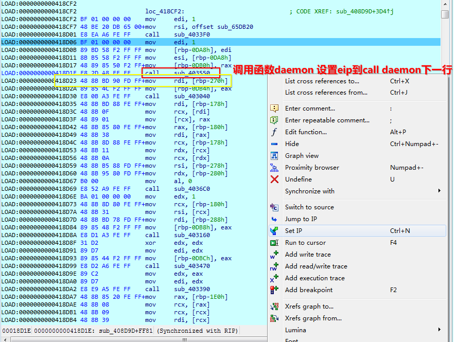

- AESKeygenassist   
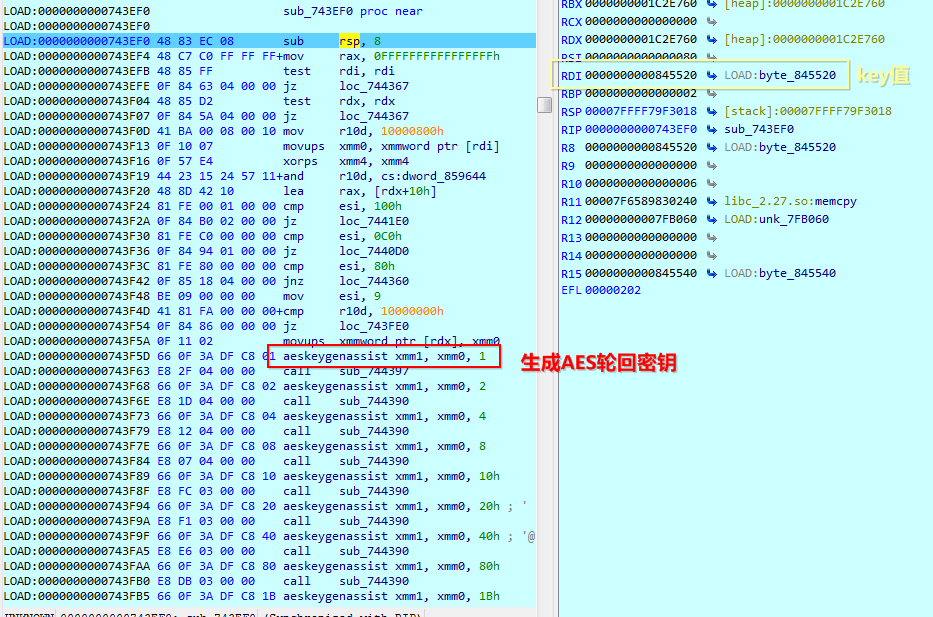

- AESIMC   
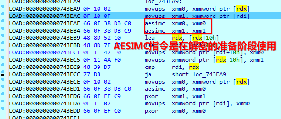

- 解密函数  使用[汇编](http://blog.nsfocus.net/hardware-accelerate-extortion-software-xdata/)进行AES解密
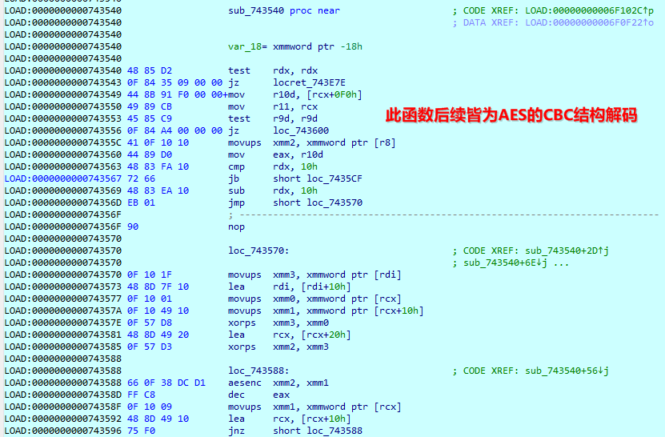


### 静态解密调用

```python
def get_domain_port(filepath):
    dict_ret = {}
    try:
        with open(filepath, 'rb') as fp:
            szbuf_file = fp.read()

            fva_upx = szbuf_file.rindex(b'\x55\x50\x58\x21')

            if szbuf_file[fva_upx + 0x24:fva_upx + 0x28] == b'\x48\x4F\x4F\x4B' and fva_upx != -1:#HOOK
                len_decodedata = int.from_bytes(szbuf_file[fva_upx + 0x28: fva_upx + 0x2c], byteorder='little', signed=False)
                #判断是否加密数据与之相等

                if os.path.getsize(filepath) == fva_upx + 0x2C + len_decodedata:
                    # key和iv固定 直接解密
                    #此处不写是因为通过自己调试即可准确找到，况且GitHub原作者使用的是二进制代码，并未有意愿公开key和iv
                    key = ''.encode('utf-8')        
                    iv = b''
                    mode = AES.MODE_CBC
                    cryptor = AES.new(key, mode, iv)
                    bytes_decodedata = cryptor.decrypt(szbuf_file[fva_upx + 0x2C:])
                    #print(bytes_decodedata)
                    #判断解密是否正确
                    if bytes_decodedata.find(b"-----BEGIN PUBLIC KEY-----") != -1 and bytes_decodedata.find(b"-----END PUBLIC KEY-----") != -1:
                        #转换获取数据和端口
                        dict_ret["ioc_raw"] = socket.inet_ntoa(bytes_decodedata[4:8])
                        dict_ret["port"] = int.from_bytes(bytes_decodedata[8:0xC], byteorder='little', signed=False)
    except Exception as e:
        traceback.print_exc()
    finally:
        return  dict_ret

```

效果图
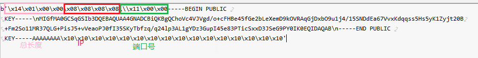