# meatploit的payload特征分析

## 渗透测试

谈Metaploit之前，笔者要谈一谈渗透测试。首先渗透测试并没有一个标准的定义，通用说法是通过模拟恶意黑客的攻击方法，来评估计算机网络系统安全，知晓系统中存在的安全隐患和问题。

渗透测试的特点是：渗透测试是一个渐进的并且逐步深入的过程。渗透测试是选择不影响业务系统正常运行的攻击方法进行的测试。

图 1 渗透

提前发现网络中的漏洞，并进行必要的修补，就像是未雨绸缪；而被其他人发现漏洞并利用漏洞攻击系统，发生安全事故后的补救，就像是亡羊补牢。很明显未雨绸缪胜过亡羊补牢。

也许你还有疑问？我定期更新安全策略和程序，时时给系统打补丁，并采用了安全软件，以确保所有补丁都已打上，还需要渗透测试吗？答案，需要。千里之堤，溃于蚁穴，只有不断的自我测试，修补一个个很小的漏洞，才能在真正的“洪水”到来时，大坝屹然不动

图 2 千里之堤溃于蚁穴

## 渗透过程

图 3 渗透流程

黑客的渗透过程一般包括预攻击、攻击和后攻击三个阶段：

>   预攻击：主要指一些信息收集和漏洞扫描的过程

>   攻击：主要是利用第一阶段发现的漏洞或弱口令等脆弱性进行入侵

>   后攻击：是指在获得攻击目标的一定权限后，对权限的提升、后门安装和痕迹清除等后续工作

在如今的渗透攻击和测试中，随着互联网的高速发展，信息安全越来越受到社会的关注，也更标准化、流程化，个人自身完成一整套渗透攻击链已变的越来越困难，于是在各个阶段涌现出一批又一批的垂直化渗透工具，通过这些渗透工具不仅测试人员使用，黑客同样使用。

所以，了解其实现原理以及特征就显得十分有必要了。

## meatploit简述

Metaploit正是其中后渗透工具的翘楚。说起Metaploit这个词，可能大多数普通人不太了解，但对于搞渗透测试的人来说，它就犹如地之于豹，水之于鱼，天之于鹰，是当今安全专业人员免费提供的最有用的审计工具之一，同样的，黑客对其也是爱不释手。

Metasploit
是一个渗透测试开源软件，也是一个逐步发展成熟的漏洞研究与渗透测试代码开发平台。它的全称叫做The
Metasploit Framework，以下简称叫做MSF， 开源地址

**Github**：<https://github.com/rapid7/metasploit-framework>

## 历史发展

-   MSF项目最初是由 HD Moore 在 2003 年夏季发布基于 Perl 语言(pl)的 Metasploit
    版本，当时一共集成了 11 个渗透攻击模块。

-   在 2004 年 4 月，HD
    Moore与一位志同道合之士Spoonm完全重写了代码。发布了Metasploit
    v2.0，版本中已经包含18个渗透攻击模块和27个攻击载荷模块，并提供了控制台终端、命令行和Web三个使用接口。

-   2004 年 8 月，HD 和 Spoonm 带着最新发布的 Metasploit v2.2
    并在拉斯维加斯举办的 BlackHat 全球黑客大会上进行了演讲，更多的黑客加入
    Metasploit 核心开发团队与贡献渗透攻击、载荷与辅助模块代码。

-   2007 年 5 月发布了 v3.0 版本， MSF团队使用 Ruby 语言（.rb）完全重写了
    Metasploit，其中包含 177 个渗透攻击模块、104 个攻击载荷模块以及 30
    个新引入的辅助模块。

-   2009 年 10 月，Metasploit 项目被一家渗透测试技术领域的知名安全公司 Rapid7
    所收购，次年发布了MetasploitExpress和Pro商业版本，从而进军商业化渗透测试解决方案市场。

-   Metasploit v4.0 在 2011 年 8 月发布。v4.0
    版本在渗透攻击、攻击载荷与辅助模块的数量上都有显著的扩展，此外还引入一种新的模块类型——后渗透攻击模块，以支持在渗透攻击环节中进行敏感信息搜集、内网拓展等一系列的攻击测试。

-   Metasploit v5.0 在 2019 年 1 月份发布。Metasploit 5.0
    使用了新的数据库，并提供了一种新的数据服务，引入了新的规避机制，支持多项语言，以便应对不断增长的世界级攻击性内容库的框架基础上。

## 结构

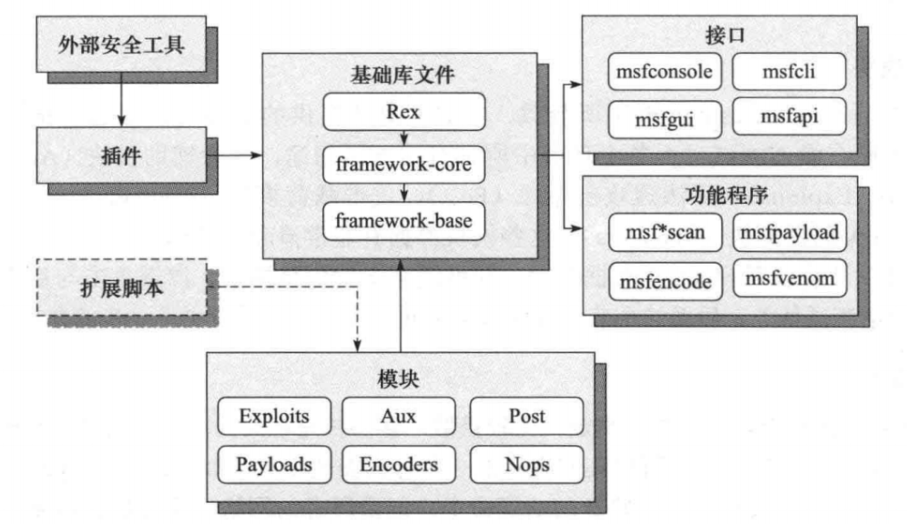

图 4 Metaploit V4结构

Metasploit设计尽可能采用模块化的理念。以下将简单介绍其作用

### 基础库文件

metasploit基础库文件位于源码根目录路径下的libraries目录中，包括Rex，framework-core和framework-base三部分。

Rex是整个框架所依赖的最基础的一些组件，如包装的网络套接字、网络应用协议客户端与服务端实现、日志子系统、渗透攻击支持例程、PostgreSQL以及MySQL数据库支持等；

framework-core库负责实现所有与各种类型的上层模块及插件的交互接口；

framework-base库扩展了framework-core，提供更加简单的包装例程，并为处理框架各个方面的功能提供了一些功能类，用于支持用户接口与功能程序调用框架本身功能及框架集成模块。

### 插件

插件能够扩充框架的功能，或者组装已有功能构成高级特性的组件。插件可以集成现有的一些外部安全工具，如Nessus、OpenVAS漏洞扫描器等，为用户接口提供一些新的功能。

### 接口

包括msfconsole控制终端、msfcli命令行、msfgui图形化界面、armitage图形化界面以及msfapi远程调用接口。

### 功能程序

除了用户使用用户接口访问metasploit框架主体功能之外，metasploit还提供了一系列可直接运行的功能程序，支持渗透测试者与安全人员快速地利用metasploit框架内部能力完成一些特定任务。比如msfpayload、msfencode和msfvenom可以将攻击载荷封装为可执行文件、C语言、JavaScript语言等多种形式，并可以进行各种类型的编码。

### 模块

模块是通过Metasploit框架所装载、集成并对外提供的最核心的渗透测试功能实现代码。分为辅助模块（Auxiliary)、渗透攻击模块（Exploits)、后渗透攻击模块（Post)、攻击载荷模块（payloads)、编码器模块（Encoders)、空指令模块（Nops)以及新增功能免杀模块（Evasion）。

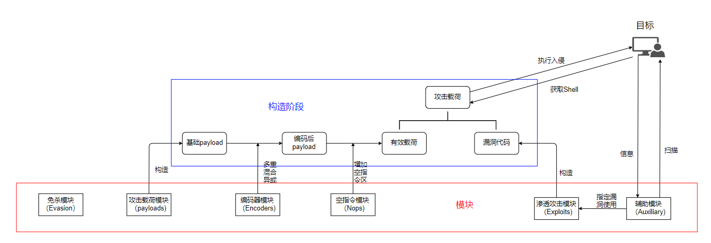

图 5 模块功能结构

#### 辅助模块（Auxiliary)

MSF
为渗透测试的信息搜集环节提供了大量的辅助模块支持，包括针对各种网络服务的扫描与查点、构建虚假服务收集登录密码、口令猜测破解、敏感信息嗅探、探查敏感信息泄露、Fuzz
测试发掘漏洞、实施网络协议欺骗等模块。

辅助模块能够帮助渗透测试者在渗透攻击之前取得目标系统丰富的情报信息，从而发起更具目标性的精准攻击。

#### 渗透攻击模块(Exploits)

渗透攻击模块是利用发现的安全漏洞或配置弱点对目标系统进行攻击，以植入和运行攻击载荷，从而获取对远程目标系统访问权的代码组件

安全漏洞所在的位置分为主动渗透攻击与被动渗透攻击

1.  主动渗透攻击：安全漏洞位于网络服务端软件与服务端软件承载的上层应用程序之中，由于这些服务通常是在主机上开启一些监听端口并等待客户端连接，通过连接目标系统网络服务。然后利用特殊构造的数据进行网络请求，触发漏洞执行攻击数据，最终获取shell会话。

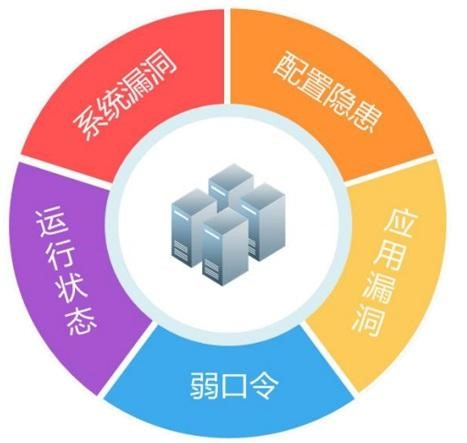

图 7 漏洞

2.  被动渗透攻击：利用漏洞位于客户端软件中，如浏览器、浏览插件、电子邮件客户端、office与Adobe等各种文档与编辑软件，等目标系统上的用户访问到这些邪恶内容，从而触发客户端软件中的安全漏洞，给出控制目标系统的shell会话。

    

图 8 钓鱼邮件

#### 攻击载荷模块（Payloads）

攻击载荷是在渗透攻击成功后使目标系统运行的一段植入代码，通常作用是为渗透攻击者打开在目标系统上的控制会话连接，下面会详细介绍。

#### 空指令模块(NOP)

空指令(NOP)
是一些对程序运行状态不会造成任何实质影响的空操作或者无关操作指令。最典型的空指令就是空操作，在
x86 CPU 体系架构平台上的操作码是 0x90 。

原因：真正要执行的Shellcode之前添加一段空指令区，这样当触发渗透攻击后跳转执行Shellcode
时，有一个较大的安全着陆区，从而避免受到内存地址随机化、返回地址计算偏差等原因造成的Shellcode执行失败，提高渗透攻击的可靠性。以下为截取一部分window中Nop的代码，这些指令随机生成，不影响payload执行，也没有规律

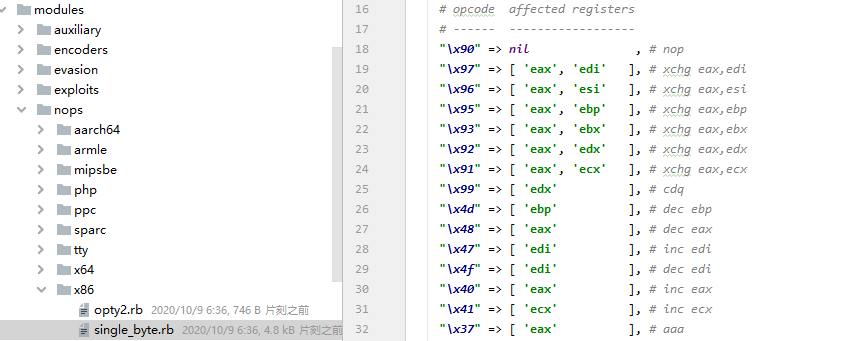

图 9 window/x86下Nop部分指令

#### 编码器模块（Encode）

渗透攻击中，由于漏洞参数的限制等，生成的代码可能被截断导致无法攻击成功。以下会详细介绍。

作用：

-   确保攻击载荷中不会出现滲透攻击过程中应加以避免的“坏字符”，比如字符串参数中不能出现’\\x00’

-   攻击载荷进行“免杀”处理，即逃避反病毒软件、IDS
    人侵检测系统和IPS人侵防御系统的检测与阻断。

#### 后渗透攻击（Post）

1.  后渗透攻击模块主要支持在渗透攻击取得目标系统控制权之后，在受控系统中进行各式各样的后渗透攻击动作，比如获取敏感信息、进一步拓展、实施跳板攻击等

2.  Meterpreter
    作为可以被渗透攻击植入到目标系统上执行的一个攻击载荷，除了提供基本的控制会话之外，还集成了大量的后渗透攻击命令与功能，并通过大量的后渗透攻击模块进一步提升它在本地攻击与内网拓展方面的能力。

#### 免杀模块(Evasion)

免杀模块核心功能对攻击载荷进行”免杀”处理。现阶段只存在window类型，包含对window
defender的免杀，免杀方式较为简单，申请内存，拷贝攻击载荷，执行攻击载荷

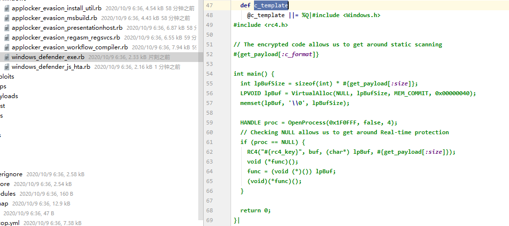

图 10 部分免杀模块

## Payload规律

### 分类

攻击载荷模块在执行方式上分为独立(Single)、传输器(Stager)、传输体(Stage)，前者单独执行，后两种为共同执行的方式。Single
= stager +

-   single：独立载荷，可直接植入目标系统并执行相应的程序

-   stager：传输器载荷，用于目标机与攻击机之间建立稳定的网络连接，与传输体载荷配合攻击。通常该种载荷体积都非常小，可以在漏洞利用后方便注入。

-   stage：传输体载荷，如shell，meterpreter等。在stager建立好稳定的连接后，攻击机将stage传输给目标机，由stagers进行相应处理，将控制权转交给stage。比如得到目标机的shell，或者meterpreter控制程序运行。

图 11 火箭分离

其实Single等于Stage和Stager的集合。Stage+Stager应用在攻击载荷的大小、运行条件有限制的环境，比如漏洞填充缓冲区的可用空间很小、Windows
7等新型操作系统所引入的NX (堆栈不可执行)、DEP
(数据执行保护)等安全防御机制，就像火箭卫星一样，分阶段植入以达到目的。

### 类型识别

Metaploit的类型根据不同平台，不同通讯方式，不同执行方式相互组合后共有500多种。

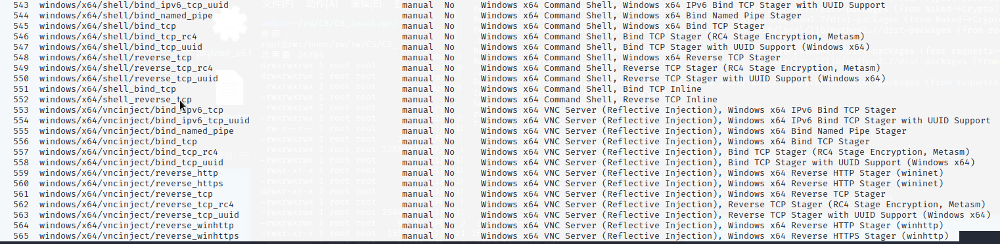

图 12 Metaploit部分类型

识别类型可以明确用了那些方式生成的

-   Staged payloads:\<platform\>/[arch]/\<stage\>/\<stager\>

-   Single payloads: \<platform\>/[arch]/\<single\>

    \----------------\<platform\>平台；[arch]架构，可选；后面是类型

-   windows/x64/meterpreter/reverse_tcp：平台是windows，架构是x64，Stage是reverse_tcp，最终稳定运行在目标的代码Stager是meterpreter

-   windows/x64/meterpreter_reverse_tcp：平台是windows，架构是x64，作为独立的载荷

### 生成

在kail中集成了Metaploit框架，有两种方式。

-   可以直接使用Msfconsole一体化集中控制台

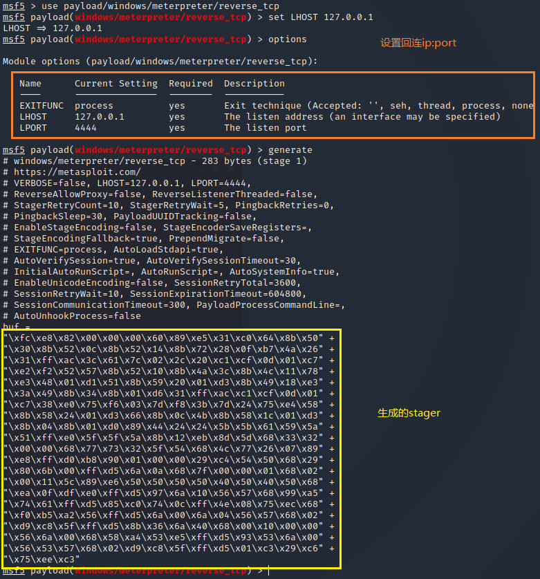

图 13 msfconsole生成stager

-   也可以使用msfvenom工具直接生成。

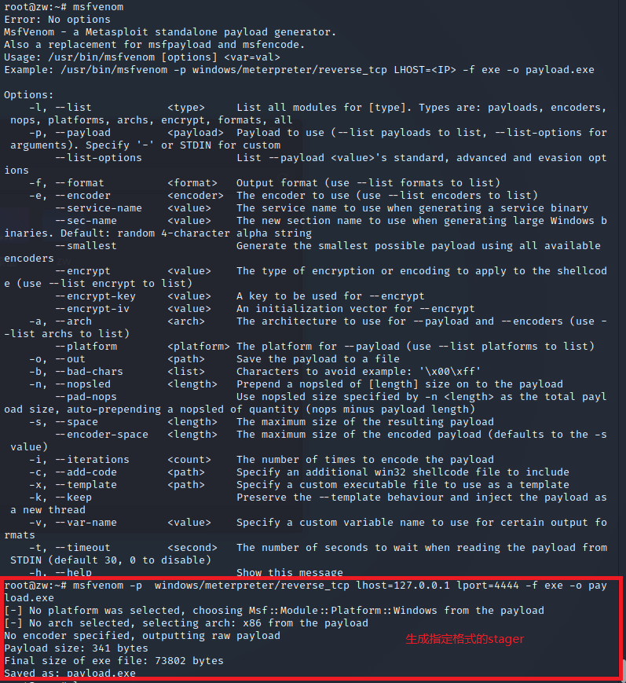

图 14 msfvenom生成stager

### Stage+Stager 

#### Stager 

##### 结构：

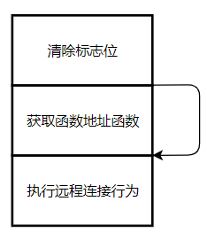

图 15 Stager结构图

-   清除标志位，避免前面的nop指令或者漏洞利用的代码等产生干扰，从而执行失败

-   获取函数地址，通过PEB结构获取当前程序的函数地址

-   执行行为，调用函数，引导stage，建立稳定连接

###### 清除标志位

使用cld清除标志位，然后跳转到执行远程连接行为，其中源码部分如下:

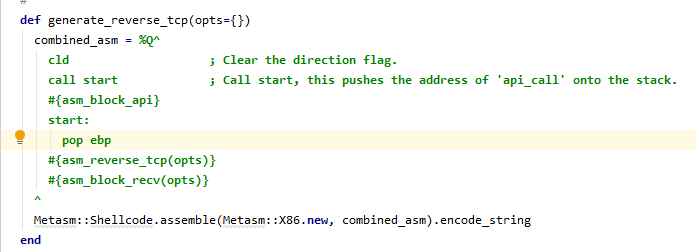

图 16 Metaploit的reverse_tcp

生成的样本部分

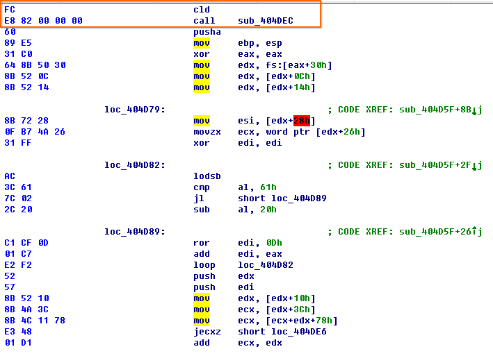

图 17 IDA下stager

###### 获取函数地址

采用的方式是PEB寻址原理。如下图所示，在NT内核系统中fs寄存器指向TEB结构，TEB+0x30处指向PEB结构，PEB+0x0c处指向PEB_LDR_DATA结构，PEB_LDR_DATA结构中包含本程序调用的dll链表，遍历链表，逐个遍历dll导出表的函数名称，算出其hash，对比传入的hash即获取到函数地址

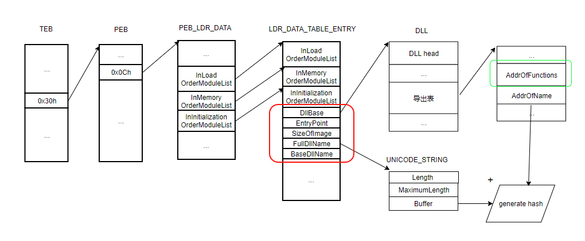

图 18 获取函数地址结构图

此外，根据笔者研究过Cobalt
Strike，其使用的寻址方式以及计算方式获取函数地址，函数hash也相同。

计算函数名称的hash方法如下：

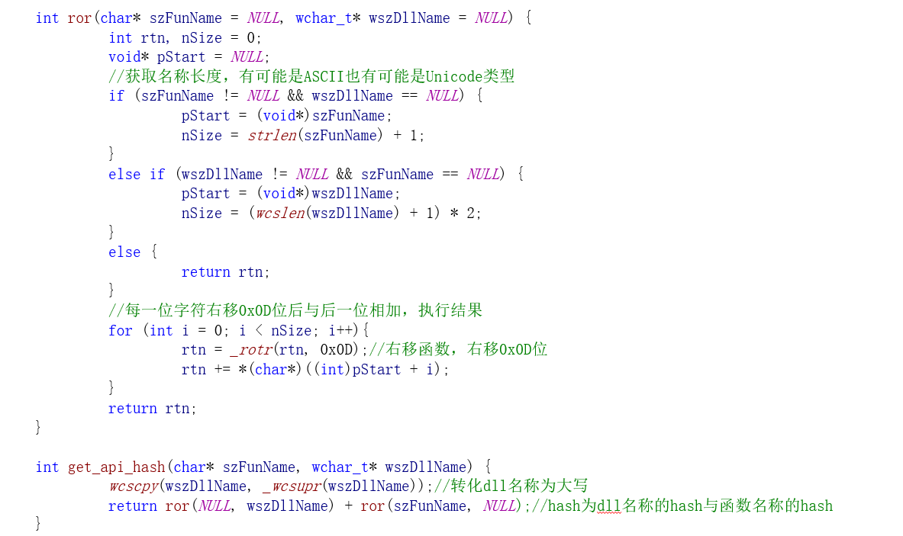

图 19 计算hash函数（C++）

常见的函数Hash如下

| Dll名称      | 函数名称                              | Hash      | 二进制(小尾) |
|--------------|---------------------------------------|-----------|--------------|
| kernel32.dll | LoadLibraryA                          | 0726774ch | 4C 77 26 07  |
|              | Virtualalloc                          | e553a458h | 58 A4 53 E5  |
|              | Sleep                                 | e035f044h | 44 F0 35 E0  |
|              | VirtualFree                           | 300f2f0bh | C2 DB 37 67  |
|              | CreateFileA                           | 4fdaf6dah | DA F6 DA 4F  |
|              | ReadFile                              | bb5f9eadh | AD 9E 5F BB  |
| wininet.dll  | InternetOpenA                         | a779563ah | 3A 56 79 A7  |
|              | InternetConnectA                      | c69f8957h | 57 89 9F C6  |
|              | HttpOpenRequestA                      | 3b2e55ebh | EB 55 2E 3B  |
|              | HttpSendRequestA                      | 7b18062dh | 2D 06 18 7B  |
|              | InternetReadFile                      | e2899612h | 12 96 89 E2  |
|              | InternetSetOptionA                    | 869e4675h | 75 46 9E 86  |
| crypt32.dll  | CertGetCertificateContextProperty     | c3a96e2dh | 2D 6E A9 C3  |
| ws2_32       | WSAStartup                            | 006b8029h | 29 80 6B 00  |
|              | WSASocketA                            | e0df0feah | EA 0F DF E0  |
|              | connect                               | 6174a599h | 99 A5 74 61  |
|              | recv                                  | 5fc8d902h | 02 D9 C8 5F  |
|              | bind                                  | 6737dbc2h | C2 DB 37 67  |
|              | closesocket                           | 614d6e75h | 75 6E 4D 61  |
|              | send                                  | 5f38ebc2h | C2 EB 38 5F  |
|              | gethostbyname                         | 803428a9h | A9 28 34 80  |
| winhttp.dll  | WinHttpOpen                           | bb9d1f04h | 04 1F 9D BB  |
|              | WinHttpConnect                        | c21e9b46h | 46 9B 1E C2  |
|              | WinHttpOpenRequest                    | 5bb31098h | 98 10 B3 5B  |
|              | WinHttpSendRequest                    | 91bb5895h | 95 58 BB 91  |
|              | WinHttpGetIEProxyConfigForCurrentUser | 600ba721h | 21 A7 0B 60  |
|              | WinHttpReadData                       | 7e24296ch | 6C 29 24 7E  |
|              | WinHttpSetCredentials                 | cea829ddh | DD 29 A8 CE  |
|              | WinHttpQueryOption                    | 272f0478h | 78 04 2F 27  |
|              | WinHttpReceiveResponse                | 709d8805h | 05 88 9D 70  |
|              | WinHttpGetProxyForUrl                 | 49eadddah | DA DD EA 49  |
|              | WinHttpSetOption                      | ce9d58d3h | D3 58 9D CE  |
| *…*          |                                       |           |              |

###### 执行网络连接行为

由于选择不同的连接方式会有不同的网络行为，从而会调用不同的函数，后面分析以resever_tcp为例，stager通过socket连接指定的IP和Port，建立连接后，申请内存，接受stage到申请的内存中，跳转到申请的内存地址首地址

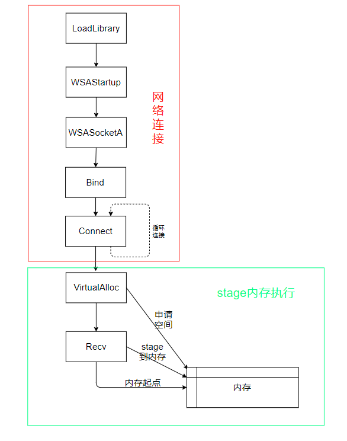

图 20 函数调用顺序

##### Yara规则

根据stager的特征可以通过清楚标志位以及函数名称的生成hash值来组合。流量以及生成的病毒文件均满足这种特征，以下为部分的yara规则：

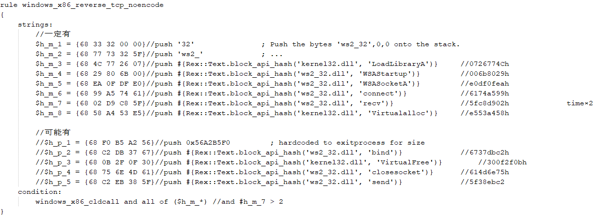

图 21 stager部分yara规则

完整yara请查看

#### Stage

##### 原理

在漏洞利用成功后漏洞利用成功后会发送第二阶段的Stage，本质上是个dll。上文提到Stager在内存中拷贝完Stage后就跳转到内存的首地址了，然后从dll的头部开始执行并运行此dll。

了解过程序运行原理的都知道，程序运行需要一个加载器加载程序，执行解析程序结构，然后CPU才执行代码。这种原理上并没有加载器，那么如何做到dll运行呢？即采用ReflectiveLoader反射注入的方式。

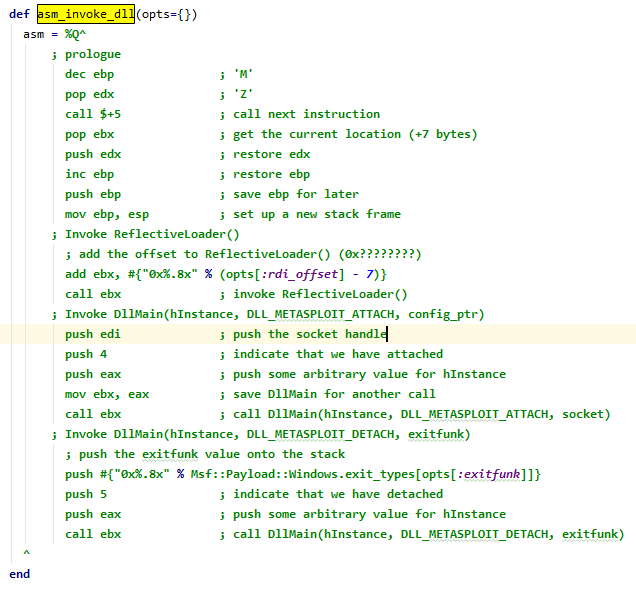

图 22 Stage汇编

原理上就是通过前面执行的汇编先调用ReflectiveLoader反射函数，ReflectiveLoader模拟加载器解析自身的结构，然后跳转到DllMain正常执行。但由于PE文件的种种限制，所以这种文件的注入方式的特点比较明显。

捕捉到明文传播stager的pcap包

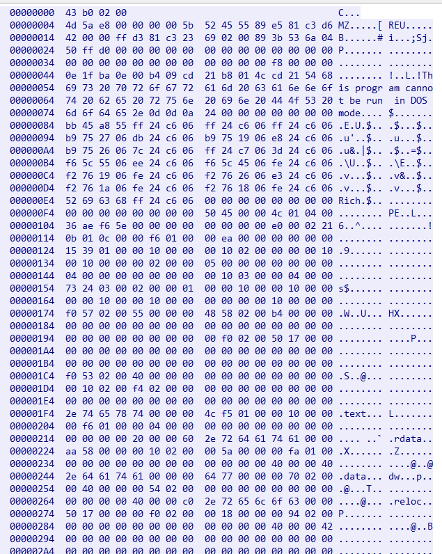

图 23 stage流量捕获

##### Yara规则

根据其文件首部调用ReflectiveLoader，以及调用的函数hash为特征识别

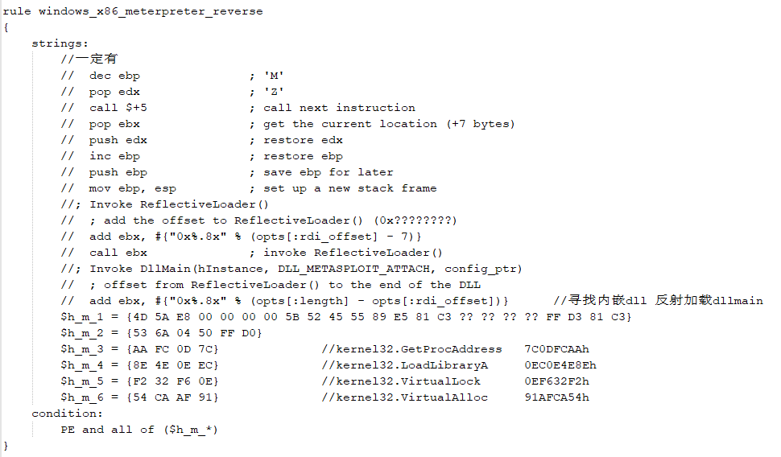

图 24 Stage部分yara规则

完整yara请查看

#### 静态提取信息

基于特定位置进行提取指定信息

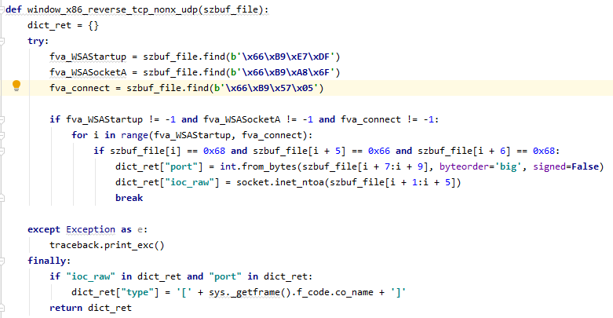

图 25 静态提取指定信息

#### hw案例

静态信息：

| SHA256   | affca8567dc9e68ef8fd2afc9ee23d3f0b1d46c3088c212b9b96b24f4148ad9f |
|----------|------------------------------------------------------------------|
| SHA1     | 85e50552b3927eaea7d05ef04d60dd8f4f9e1910                         |
| MD5      | e662d362d2ff3a4ceef3a4c84d21d655                                 |
| 样本大小 | 1684007                                                          |
| 样本格式 | RAR archive data， v5                                            |

##### 执行流程

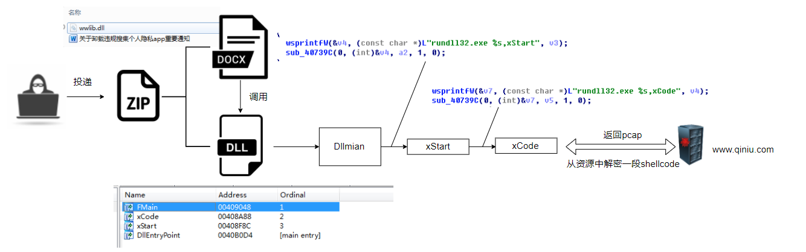

图 26 样本流程

###### 资源解密的Shellcode

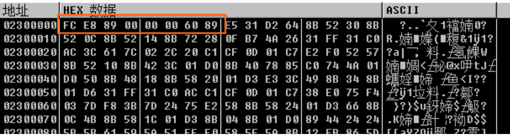

图 27 资源解密后的shellcode

可以看到，该Shellcode就是Metaploit的stager。使用相应的脚本可以直接解析出相应的IP和Port

###### 回传pcap包

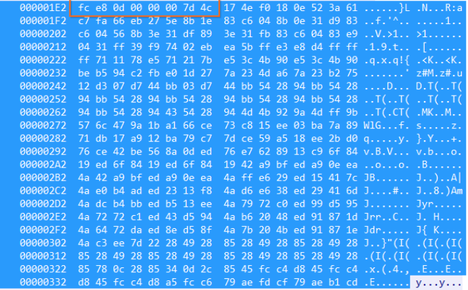

图 28 回传流量

回传的流量包中与Metaploit比较类似，经笔者分析，该回传包中为Cobalt
Strike的stager。如果此时进行流量检测，那么就可以进行拦截。

## Encode

### 介绍

上文提到stager以及stage的规律十分明显，杀毒软件非常容易检测到，并且可能由于渗透目标的种种限制，导致生成的payload无法正常使用。所以Metaploit集成了许多编码类型（Encode）以应对不同要求。

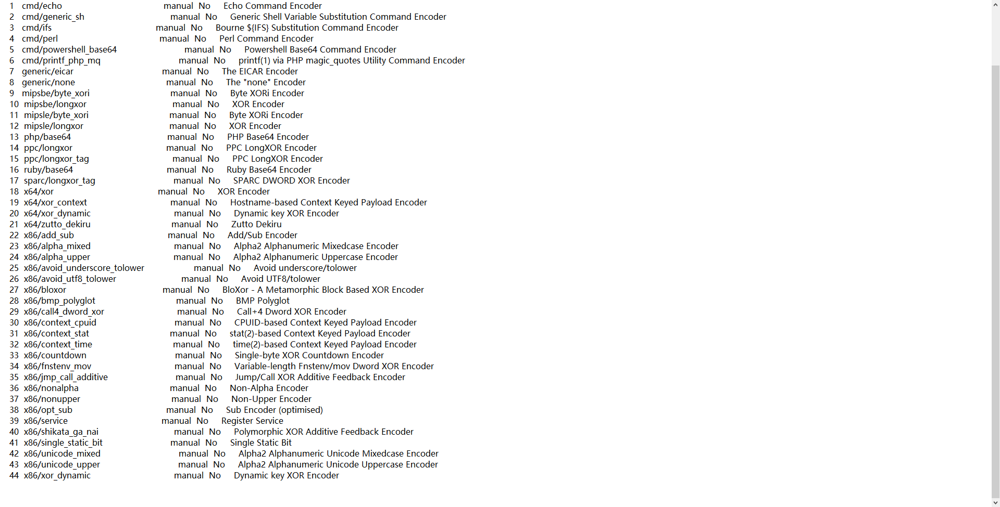

图 29 Encode类型

1.  优点：使用编码生成的payload没有坏字符以及轻微免杀。

2.  原理：基于异或的方式，但是方式不同，而且很多编码格式可以做到任意次多重编码或者多种编码格式混合编码，然而基于实现的原理，每种编码格式又一定有相应的特征。这些特征就是识别解析的关键。

3.  结构：异或循环结构+已异或的数据

    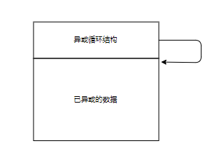

图 30 一层异或结构

>   这种异或循环是如何实现的？

1.  首先必须要找到异或后的数据起始地址，最简单的是汇编（call
    \$+5）等获取当前地址等手段，再加计算后的偏移得到数据起始地址

2.  其次数据的长度

3.  最后是异或密钥，可以是固定，也可以是异或时与前一个密钥或解密内容有关的动态方式

### x86/shikata_ga_nai 

以x86/shikata_ga_nai编码为例，这种编码最为实用和常用

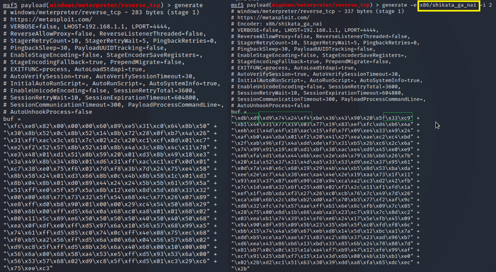

图 31 stager编码前后比照

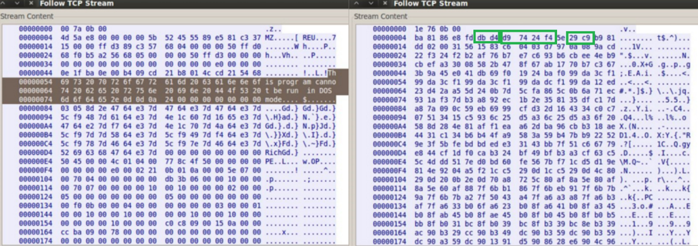

图 32 stage编码前后比照

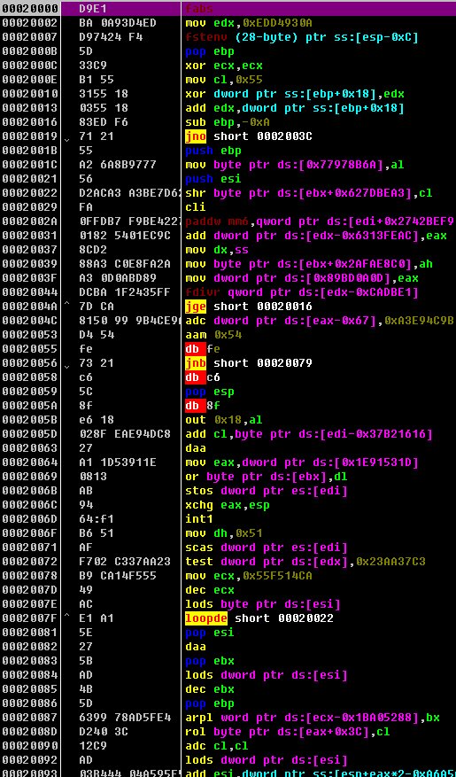

图 33 运行时解密

#### Yara规则

存在以下特征：

-   fpu_instructions:fabs/ffree/fld1等(最终作用获取当前地址，从而定位到解密位置)

-   fnstenv(\\xd9\\x74\\x24\\xf4)

-   Clear ecx; mov ecx， xxx等

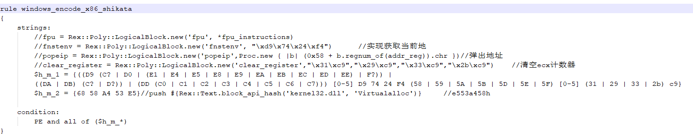

图 34 encode部分yara规则

完整yara请查看

#### 静态还原

基于这些特征，可以使用递归解密的方式还原payload
。现已支持任意编码次数以及混合编码方式的解密。

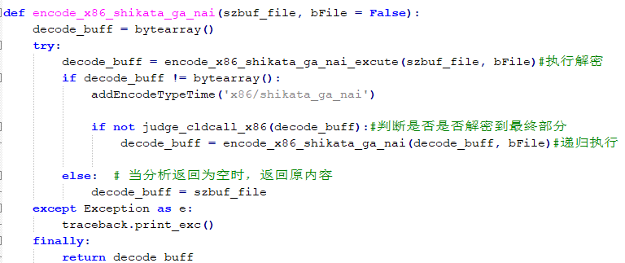

图 35 递归解密shikata_ga_nai类型

# 结语

总的来说，作为实际执行渗透攻击的急行军，Metaploit生成的payload特征还是十分明显的，一旦其建立其稳定的连接，那么其之间的流量特征就会因加密而使识别变得异常困难。所以防微杜渐，才是关键。

以上，就是笔者今天带来的Metaploit的一些规律介绍，希望之后能带来更多有意义的分享。
