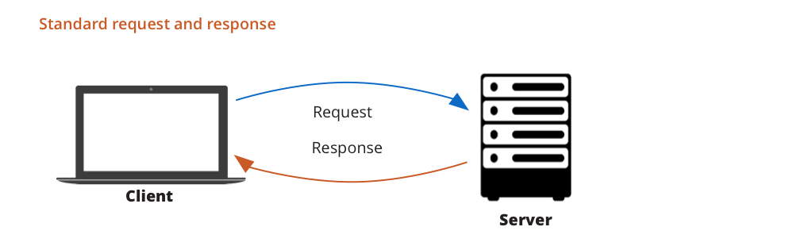
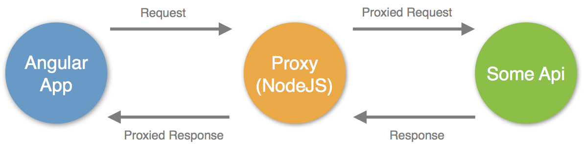
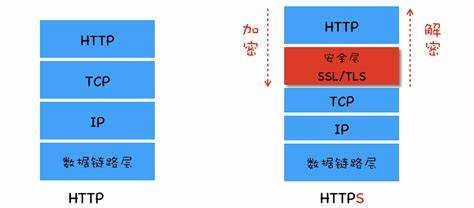
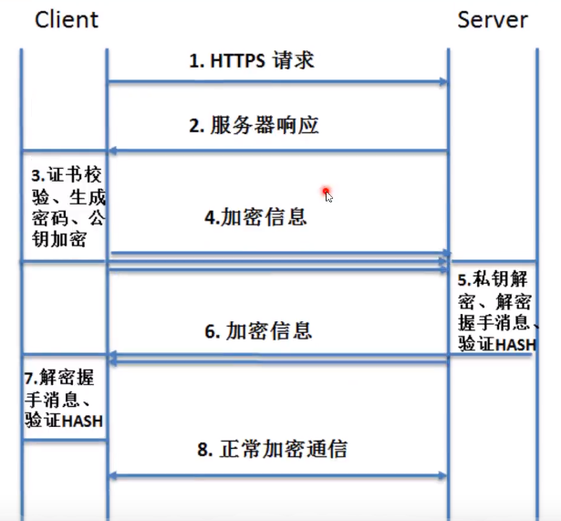

## HTTP(s)数据包

- Request 请求数据包
- Response 返回数据包

- Request 请求数据包
- Proxy代理服务器（例如Burp Suite）
- Response 返回数据包

### HTTP/HTTPS具体区别
- HTTPS速度慢,安全性高

HTTP简要通信过程：
- 1 浏览器建立WEB服务器连接
- 2 浏览器生成`请求数据包`，发送WEB服务器
- 3 WEB服务器处理后生成`响应数据包`，发送浏览器
- 4 WEB服务器关闭连接

#### Request请求数据包格式